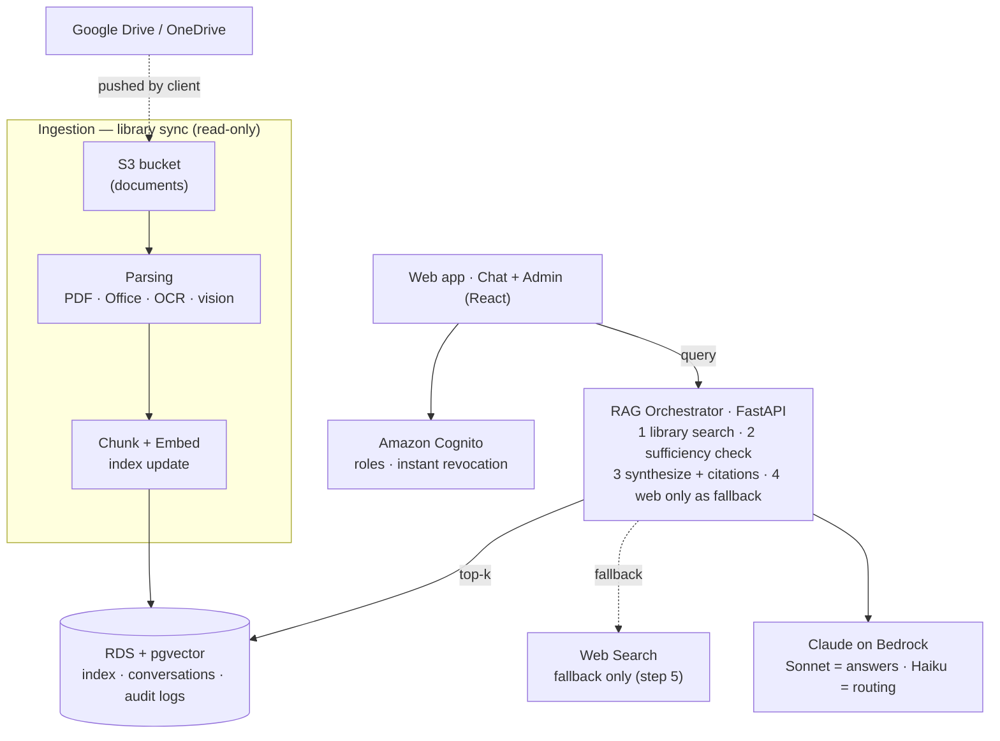

# Architecture & Decisions

The authoritative narrative lives in [`../CLAUDE.md`](../CLAUDE.md) (§1–§8). This file holds
the **architecture diagram** and **decision records**.

## Diagram

Renders on GitHub (Mermaid). It mirrors the reference sketch, with one correction noted below.

### Correction vs the reference sketch
The reference sketch drew **Google Drive / OneDrive** as direct ingestion sources. Per the
decision in [`CLAUDE.md` §2 (Ingestion)](../CLAUDE.md), the system **never connects to
OneDrive/Google directly** — documents are pushed into a private **S3 bucket**, and ingestion
reads **only** from S3. The diagram reflects that: Drive/OneDrive feed *into* S3 (by whatever
sync the client chooses); nothing in our stack holds credentials to their tenant.

> Model names are illustrative — exact Bedrock model IDs are configuration, not architecture.

## What runs today (local, $0)
Almost the whole diagram is live end-to-end on your machine — each cloud box has a local stand-in:
- **Web app** = React chat **+ admin console**, behind a **login** (roles: admin / technician).
- **Cognito** = local JWT auth (`app/auth/`): roles, instant disable, access-expiry, self-service
  password change + admin forced-reset (`must_change_password`) — same route guards Cognito would
  sit behind.
- **RAG Orchestrator** = FastAPI locally (not Lambda yet). Per query: history-aware query rewrite →
  **hybrid retrieval** (pgvector similarity + Postgres full-text) fused with **RRF** → vector-based
  sufficiency gate → grounded answer with `manual · page · section` citations → web fallback if the
  library is insufficient → audit.
- **Rerank** (from the reference flow) = **RRF fusion** of the vector + keyword rankings — a $0,
  no-model reranker that also fixes exact-token misses (error codes, part numbers, model names).
- **Claude on Bedrock** = **Ollama** (`aya-expanse:8b` + `bge-m3`, multilingual) behind a
  swappable client — $0, offline.
- **Web Search** fallback = **DuckDuckGo** (no key), runs only when the library is insufficient.
- **RDS + pgvector** = **Postgres + pgvector in Docker** (chunks **+ users + audit log**); HNSW
  vector index + GIN full-text index.
- **Ingestion** = admin uploads a PDF (or a local folder) → **pdfplumber** (section-aware prose +
  whole-table chunks) → **Tesseract OCR fallback** for scanned pages/drawings (local stand-in for
  Textract) → chunk → embed. No S3 yet.
- **Eval** = `make eval` (`app/eval/`) scores retrieval hit-rate / MRR / routing so RAG changes are
  measured, not eyeballed. (No cloud equivalent — a local quality gate.)

Still cloud-only: real Cognito, RDS, S3 ingestion, and all AWS infra. The app logic is unchanged —
only the backing services differ. OCR runs locally via Tesseract instead of Textract.

**Note:** the schema gained `Chunk.section` / `Chunk.kind` and `User.must_change_password`. There's
no migration tool locally (SQLAlchemy `create_all`), so after pulling these changes reset the DB
volume and re-ingest: `docker compose down -v && docker compose up` then `make ingest`.

## Decision records

### ADR-0001 — Phase 1: chat UI over a streaming stub
- **Status:** accepted (2026-07)
- **Context:** first deliverable is a demoable, Claude-like chat. RAG/auth/DB are later phases.
- **Decision:** ship `frontend/` (minimal custom React) + `backend/` (FastAPI) with a
  **canned SSE reply**. Lock the `/api/chat` streaming contract (`token` deltas → `done`
  event) now so the RAG core plugs in behind it later without frontend changes.
- **Consequences:** no AWS dependency to demo; the citation UI slot exists but is empty until
  retrieval returns citations.

### ADR-0002 — Single environment, minimal DevOps surface
- **Status:** accepted (2026-07)
- **Context:** this is one application for one company (Jensen), not a multi-tenant product.
- **Decision:** **one environment** (no dev/prod split), **one Dockerfile per service**, and
  DevOps kept to two places — `.github/workflows/` (CI: one per service) and `infra/` (all AWS
  resources, flat). No elaborate release/branching strategy.
- **Consequences:** simpler to reason about and operate; if a staging environment is ever
  needed, it can be added later without reshaping the repo.

### ADR-0003 — Hybrid retrieval + RRF as the (local, $0) reranker
- **Status:** accepted (2026-07)
- **Context:** the reference flow has a rerank step; pure vector search blurs exact tokens
  (error codes like `E14`, part numbers, model names). A cross-encoder reranker would add torch +
  a ~2GB model — heavy on the target 16GB machine and against the $0/offline constraint.
- **Decision:** run **pgvector similarity + Postgres full-text (`simple` config, GIN index)** and
  fuse the two rankings with **Reciprocal Rank Fusion**. The internal-first **sufficiency gate
  stays vector-distance-based**, so routing behaviour is unchanged; RRF only re-orders the passing
  chunks. Config-flagged (`hybrid_enabled`).
- **Consequences:** better precision + exact-token recall with no new model/dependency. In cloud,
  a Bedrock/cross-encoder reranker can replace RRF behind the same retrieval seam if measured to help.

### ADR-0004 — Structure-aware ingestion + OCR fallback
- **Status:** accepted (2026-07)
- **Context:** character-based chunks lose section context and shred parameter tables; scanned
  drawings are invisible to text extraction.
- **Decision:** parse with **pdfplumber**; track the nearest **section heading** (carried across
  pages) onto each chunk and into citations; keep each **table whole** as its own chunk; and when a
  page has almost no extractable text, fall back to **Tesseract OCR** (`ell+eng`), degrading
  gracefully if the binary is absent. Local stand-in for Textract.
- **Consequences:** richer citations (`manual · page · section`), tables retrievable intact, scanned
  uploads searchable. Note: the current digital-text manual is unaffected by OCR (it already
  extracts fully) — OCR is insurance for future scanned docs.

### ADR-0005 — History-aware retrieval for multi-turn
- **Status:** accepted (2026-07)
- **Context:** follow-ups ("and for the WE110?") retrieved blind, losing the thread.
- **Decision:** pass the whole conversation to the pipeline; one fast LLM call **rewrites the
  follow-up into a standalone retrieval query** (falls back to the raw question on error), and recent
  turns are included in the generation prompt. No new tables — history lives in the client
  (persisted `conversations` deferred). Language detection stays on the original question.
- **Consequences:** coherent multi-turn troubleshooting at near-zero added complexity; a persisted
  conversation store can be added later without changing the retrieval seam.

<!-- Add further ADRs here (auth model, embedding choice, …). -->
