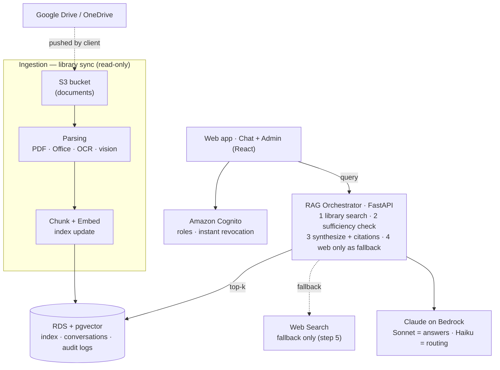

# Architecture & Decisions

The authoritative narrative lives in [`../CLAUDE.md`](../CLAUDE.md) (§1–§8). This file holds
the **architecture diagram** and **decision records**.

## Diagram

Renders on GitHub (Mermaid). It mirrors the reference sketch, with one correction noted below.

### Correction vs the reference sketch
The reference sketch drew **Google Drive / OneDrive** as direct ingestion sources. Per the
decision in [`CLAUDE.md` §2 (Ingestion)](../CLAUDE.md), the system **never connects to
OneDrive/Google directly** — documents are pushed into a private **S3 bucket**, and ingestion
reads **only** from S3. The diagram reflects that: Drive/OneDrive feed *into* S3 (by whatever
sync the client chooses); nothing in our stack holds credentials to their tenant.

> Model names are illustrative — exact Bedrock model IDs are configuration, not architecture.

## What runs today (local, $0)
The **Web app → RAG Orchestrator → vector store → ingestion** path is live end-to-end,
running entirely on your machine:
- **RAG Orchestrator** = FastAPI locally (not Lambda yet).
- **Claude on Bedrock** is replaced by **Ollama on your Mac** (`llama3.2:3b` + `nomic-embed-text`)
  behind a swappable client — $0, offline, no tokens.
- **RDS + pgvector** = **Postgres + pgvector in Docker**.
- **Ingestion** reads a local folder with **pypdf** (no S3, no Textract OCR).

Not yet built: **Cognito**, **Web Search** fallback, conversation/audit tables, admin console,
and all AWS infra. Those stay labelled placeholders until their phase.

## Decision records

### ADR-0001 — Phase 1: chat UI over a streaming stub
- **Status:** accepted (2026-07)
- **Context:** first deliverable is a demoable, Claude-like chat. RAG/auth/DB are later phases.
- **Decision:** ship `frontend/` (minimal custom React) + `backend/` (FastAPI) with a
  **canned SSE reply**. Lock the `/api/chat` streaming contract (`token` deltas → `done`
  event) now so the RAG core plugs in behind it later without frontend changes.
- **Consequences:** no AWS dependency to demo; the citation UI slot exists but is empty until
  retrieval returns citations.

### ADR-0002 — Single environment, minimal DevOps surface
- **Status:** accepted (2026-07)
- **Context:** this is one application for one company (Jensen), not a multi-tenant product.
- **Decision:** **one environment** (no dev/prod split), **one Dockerfile per service**, and
  DevOps kept to two places — `.github/workflows/` (CI: one per service) and `infra/` (all AWS
  resources, flat). No elaborate release/branching strategy.
- **Consequences:** simpler to reason about and operate; if a staging environment is ever
  needed, it can be added later without reshaping the repo.

<!-- Add further ADRs here (auth model, embedding choice, rerank strategy, …). -->
